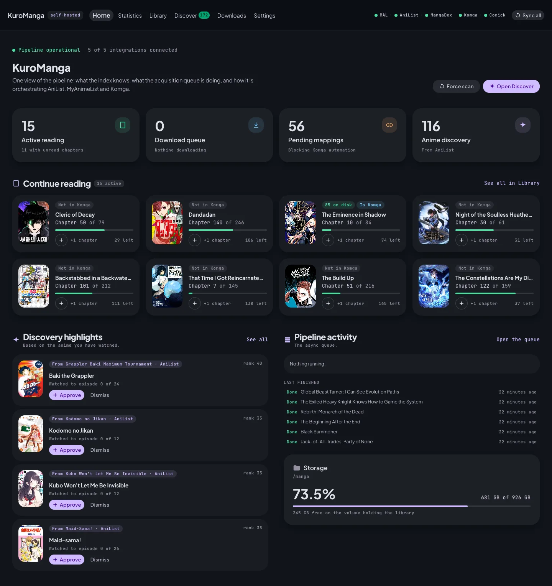

# Soshuhen

**Your reading lists, downloaded and organised, ready to read on any device.**

Soshuhen watches the manga lists you already keep on MyAnimeList, AniList and MangaBaka,
fetches the chapters you are missing, tags them properly, and hands them to
[Komga](https://komga.org) so you can read in a browser or on your phone.

It also reads your **anime** lists, and tells you which of those stories continue in a manga you
have not started.

Self-hosted. One `docker compose up`. Nothing leaves your machine.



---

## Why

Your list lives on one service. Your files live somewhere else. Keeping the two in step is
manual work that never ends — checking for new chapters, finding them, naming them so a reader
understands them, and remembering what you already have.

Soshuhen closes that gap and then stays out of the way.

- **Reads the lists you already keep.** MyAnimeList, AniList and MangaBaka. No new list to
  maintain.
- **Finds what to read next.** The anime you have finished, matched to the manga that carries the
  story on, with how far the adaptation got and how much is left.
- **Downloads only what is missing.** It knows what is already in your library and fetches the
  difference.
- **Tags everything.** Each file carries series, chapter, author, genres and a summary, so your
  reader shows a real library instead of a folder of archives.
- **Reads on any device.** Komga serves the web, and any Komga-compatible reader on iOS and
  Android.
- **Tells you what it is doing.** Live progress, a queue you can see, and failures that say why.
- **Syncs your progress back.** Finish a chapter in your reader and your MyAnimeList and AniList
  entries follow, in one step.

## Nothing downloads without you

Soshuhen never fetches anything on its own initiative.

A new entry on your list waits on the **Review** screen until you confirm which manga it is.
Confirming tells Soshuhen what the series *is* — not that it should go and get all of it. You
then choose a range, or follow the series so new chapters arrive as they are published.

Two deliberate stops, both there so your disk and your bandwidth stay yours to spend.

## Quick start

```bash
git clone https://github.com/jacksonfdam/soshuhen.git
cd soshuhen
cp .env.example .env      # fill in your credentials
docker compose up -d
```

Then open **http://localhost:8080**, connect your lists in Settings, and press Sync.

Full walkthrough in [docs/configuration.md](docs/configuration.md).

**Soshuhen has no sign-in of its own**, and `docker compose up` publishes it on every interface of
the host. On a machine only you use that is fine. Before you put it anywhere else — a shared
network, a forwarded port — read
[the stack has no authentication of its own](docs/configuration.md#the-stack-has-no-authentication-of-its-own).
It holds write credentials for your reading lists.

## Documentation

| | |
|---|---|
| [Features](docs/features.md) | What each screen does and how the pipeline works |
| [Configuration](docs/configuration.md) | Credentials, environment variables and first run |
| [All documentation](docs/README.md) | Architecture, data model, jobs and external contracts |
| [MCP server](docs/mcp.md) | Driving the pipeline from an assistant, including a locally hosted one |

## Built with

Python, FastAPI and PostgreSQL on the backend. React on the front. Komga for reading. Chapters are
fetched and archived in Python, against source modules ported from the Tachiyomi extensions.

## License and credits

MIT. See [LICENSE](LICENSE).

Soshuhen orchestrates other people's work — Komga, the extension authors whose sources it was
ported from, and the databases that make a reading list mean anything.
[CREDITS.md](CREDITS.md) names them.
