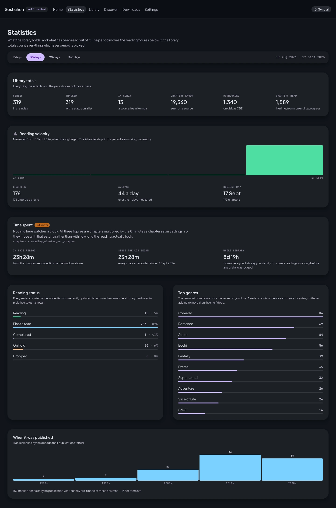
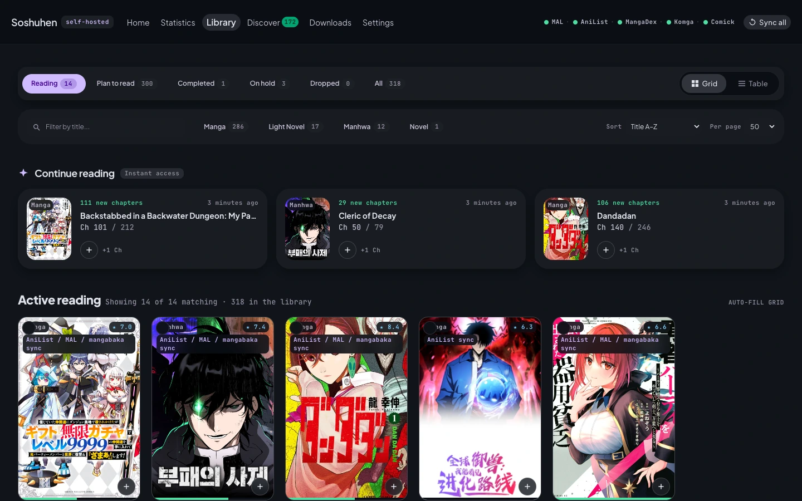
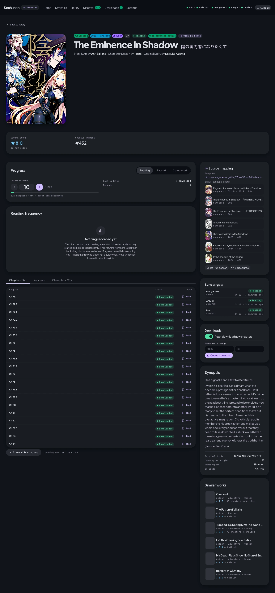
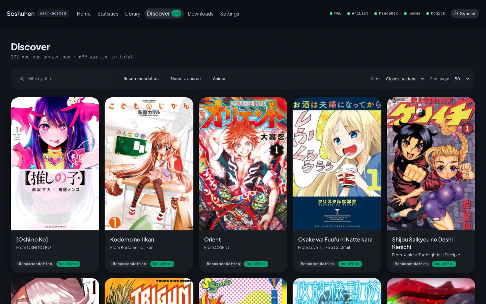
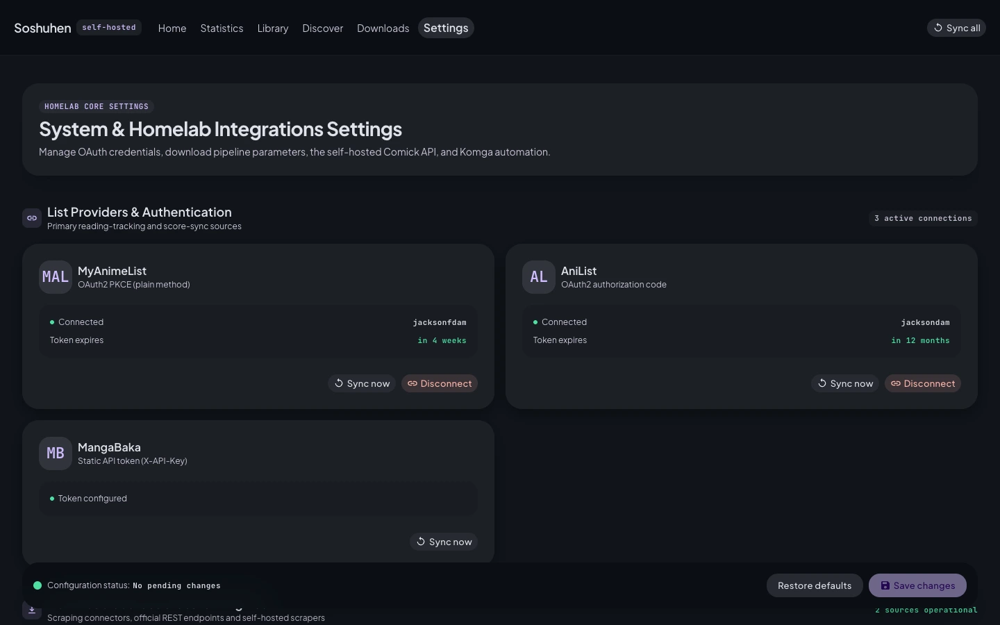
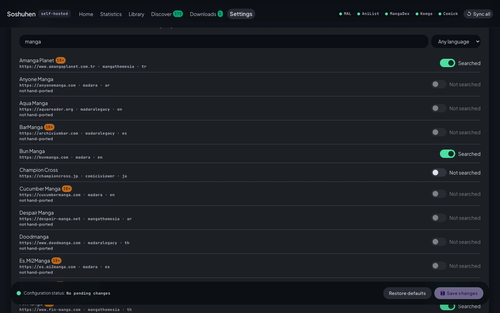

# Features

## How it works

```
your lists  ──>  one canonical series  ──>  you confirm the source  ──>  chapters
(MAL, AniList, MangaBaka)                                                   │
                                                     CBZ + metadata  <──────┘
                                                            │
                                                    Komga  ──>  any reader
```

Everything runs as background jobs. Nothing blocks the interface, and every step reports what it
is doing while it does it.

### One series, however many lists

The same manga on MyAnimeList and on AniList is one thing, not two. Soshuhen merges them into a
single series, so it maps once, downloads once, and keeps one folder — no matter how many lists
that title appears on.

### Nothing downloads without you

Two deliberate stops:

**Confirming the source.** A new entry waits on the Discover screen. Soshuhen searches the source
site and shows what it found, with covers, years and chapter counts, and you pick the right one.
An automatic guess that got this wrong would download the wrong manga for every future chapter,
so it asks once and then remembers.

**Choosing what to fetch.** Confirming a mapping says what a series *is*, not that its whole
backlog should be downloaded. You choose a chapter range, or mark the series as followed so new
chapters arrive as the source publishes them. Everything else stays catalogued, visible, and
costs you nothing.

### Downloads that behave

Chapters are fetched in batches, which keeps source sites from rate-limiting you — a batch costs
one index read instead of one per chapter.

Failures retry on a widening schedule and then stop and say why, in plain text, on the Downloads
screen. A chapter the source does not publish in your language is marked and set aside rather
than retried forever. A worker that dies mid-download hands its work back instead of losing it.

Some sites do not serve a page as a picture of the page. They cut it into tiles and shuffle them,
and only their own reader puts it back. Soshuhen reassembles those before the archive is written,
so what lands on disk is the page — not a mosaic that opens fine in Komga and cannot be read. The
check that the site sent an image at all still runs first, on the bytes as they arrived, because a
reassembled error page would otherwise start looking like a picture.

### Files a reader understands

Each chapter is written as a CBZ with a `ComicInfo.xml` inside carrying series, chapter number,
title, author, artist, genres, year and summary, pulled from your list providers.

Files land as `Series Name - Ch.0012 - Chapter Title.cbz`, zero-padded so they sort correctly,
and are written atomically — Komga never sees a half-finished download.

Already own some chapters? Drop them into the library folder. Soshuhen sees them, counts them as
present, and will not download them again.

### Progress that follows you

Finish a chapter in your reader and Soshuhen writes that progress back to your lists.

It only ever moves progress forward. If a list already records a higher chapter than your reader
does, the list wins — reading somewhere else never gets undone.

## The screens

### Home

The whole pipeline in one view: how many series you are actively reading, what the download queue
is doing, how many mappings are waiting on you, and how many suggestions are ready. Underneath,
the series you are part way through — each with a one-click way to record another chapter read —
alongside the newest suggestions, what the queue has just finished, and how much room is left on
the disk holding your library.


### Statistics

What the library looks like as a whole, over the last 7, 30, 90 or 365 days. Totals for series
tracked, how many reached Komga, and chapters known against downloaded against read. Then the shape
of it: how your titles split across the five list states, your ten commonest genres, and which
decades they were published in.

Two panels come with a caveat printed on them rather than buried in a caption. Reading velocity is
drawn only from the day chapter events started being recorded, so a flat stretch before that is an
absence of history rather than a month of reading nothing. Time spent is an estimate and says so —
nothing in the pipeline observes how long you read, so it is chapters multiplied by a figure you set
in Settings.

A series on both MyAnimeList and AniList is counted once. It is one thing on the shelf, and counting
it twice would inflate every distribution on the screen.



### Library

Every series Soshuhen knows about, with covers, which lists it came from, how many chapters you
have against how many exist, and its current state. Filter by state or by format, search by title,
sort by title, by what was updated most recently or by how far along you are, choose a page size,
choose a range to download, or follow a series.

Covers or a table, whichever reads better — the toggle sits with the rest of the controls. Above
both, the series you are furthest into sit in their own strip, so the thing you came to read is not
something you have to find first.

Every one of those controls is in the address, so a filtered, sorted page can be bookmarked and
comes back the way you left it after opening a series and pressing Back.



### A series

Opening a series gives you its cover, native title, author credit, its global score and where that
places it, its synopsis and genres, the characters and related works its providers know about, and
the chapters Soshuhen has found against the ones you hold. From here you record progress — type the
chapter or step it — pick a range to download, follow the series, choose from the sources the search
found or paste a URL, and keep private notes that go nowhere near your lists.

A series no list holds yet has nowhere for a chapter to land, and says so. **Track it here** gives it
a local entry: the reading is recorded in Soshuhen and goes no further. If one of your lists later
turns out to hold the same series, the next sync carries the chapter you recorded across to it.

Three panels are worth knowing about before you need them:

**Source mapping** names the site this series is currently read from, and keeps the other candidates
the search turned up underneath it, each with how well it matched. If the mapping is wrong, the right
one is usually already on that list; re-running the search asks the sites again.

**Sync targets** shows, list by list, exactly what MyAnimeList, AniList and MangaBaka each record
right now — status, chapter and when it last moved. Three lists that disagree is a thing you can see
rather than a thing you deduce.

**Reading frequency** charts this series alone, and is honest about being young: it counts reading
events from the day they started being recorded and fills forward, so a series read for years can
still show nothing. The panel says so on itself rather than leaving you to infer it.

Where a provider serves nothing, the screen shows nothing. A release schedule and per-chapter page
counts are absent for that reason: no source states them, and an invented figure would be worse than
the gap.



### Discover

Everything waiting on a decision, in one place: manga suggested from the anime you have watched,
the anime no relation could connect to a manga, and the series waiting for you to confirm a
source. These were three screens, and they were three stages of one question — is there a manga
here you want, and which one is it?

A card says which of the three it is — a recommendation, a series missing a source, an anime with
no manga found — in the same words as the filter chips, so the badge tells you which chip would
keep it. The order is by distance to done, so the ones a single click finishes come first and the
ones needing a manual search sit behind them. The header gives both numbers, because "171 you can
answer now" is a figure you can act on and "698 waiting" on its own is not.

Search by title, filter to any of the three kinds, sort by title or by when an item arrived, and
choose 20, 50 or 100 to a page. The page number and every other control live in the address. Two
of the three kinds have a date to sort by; an unmatched anime does not, because nothing records
when it first appeared, so those sort to the end rather than being given a date that means
nothing.

Opening one asks only for what it owes, and only for the step it can actually take. A suggestion
takes a status and optionally starts downloading; the source is not asked for, because confirming
one is decided automatically when the match is exact and goes to the review path otherwise. An
unmatched anime is searched by title when you ask — never before — and you pick the manga first
and the status second. A series waiting on a source shows the candidates the search found, and if
it found none you paste a URL on the series screen. Dismissing an item stops it being suggested
again, whichever of the three it came from.

`/discovery`, `/unmatched` and `/review` redirect here.



### Downloads

What is running right now, with live progress. What failed, with the actual error and a retry
button. What is waiting. Click any job to read its full log — no need to go looking through
container output.

### Settings

Connect your lists and see when each token expires. Tune the pipeline: how many downloads run at
once, how hard a single source may be hit, batch size, and the schedules.



**Sources** is a list of every site Soshuhen knows how to read — several hundred of them, generated
from the Tachiyomi extension repository. Search it by name or key, or narrow it to one language.
Nothing is searched until you switch it on, and a site that is on is a site Discover will offer
candidates from.

A row that cannot be switched on says why, and the three reasons mean different things:

| What it says | What it means |
|---|---|
| *not hand-ported* | The site's upstream definition carries behaviour the generator will not guess at. It is listed so you know it exists, not because it can run. |
| *no implementation for the `<x>` template* | The site's family has not been ported to Python yet. Porting one template brings every site in that family with it. |
| *no implementation for this site* | A site written by hand rather than generated, whose code is not in this build. |

Two sources need something from you beyond a switch. A site behind Cloudflare needs FlareSolverr
running, and MangaFire additionally raises a challenge only a person can clear — see
[configuration](configuration.md).



## What it reads and writes

| Service | Role |
|---|---|
| MyAnimeList | Reads your manga and anime lists; writes status and progress back |
| AniList | Reads your manga and anime lists; writes status and progress back |
| MangaBaka | Reads your library; writes status and progress back |
| MangaDex | Searches for series and fetches chapters |
| Comick | An optional second source, self-hosted, if you run one |
| Any enabled source site | Searched for candidates, and fetched from once a mapping is confirmed |
| Komga | Stores and serves the library; reports what you have read |

## Reading

Soshuhen does not include a reader, because Komga already is one and a good one. It serves a web
reader, and any Komga-compatible app on iOS or Android connects to the same library — with your
progress shared across all of them.
